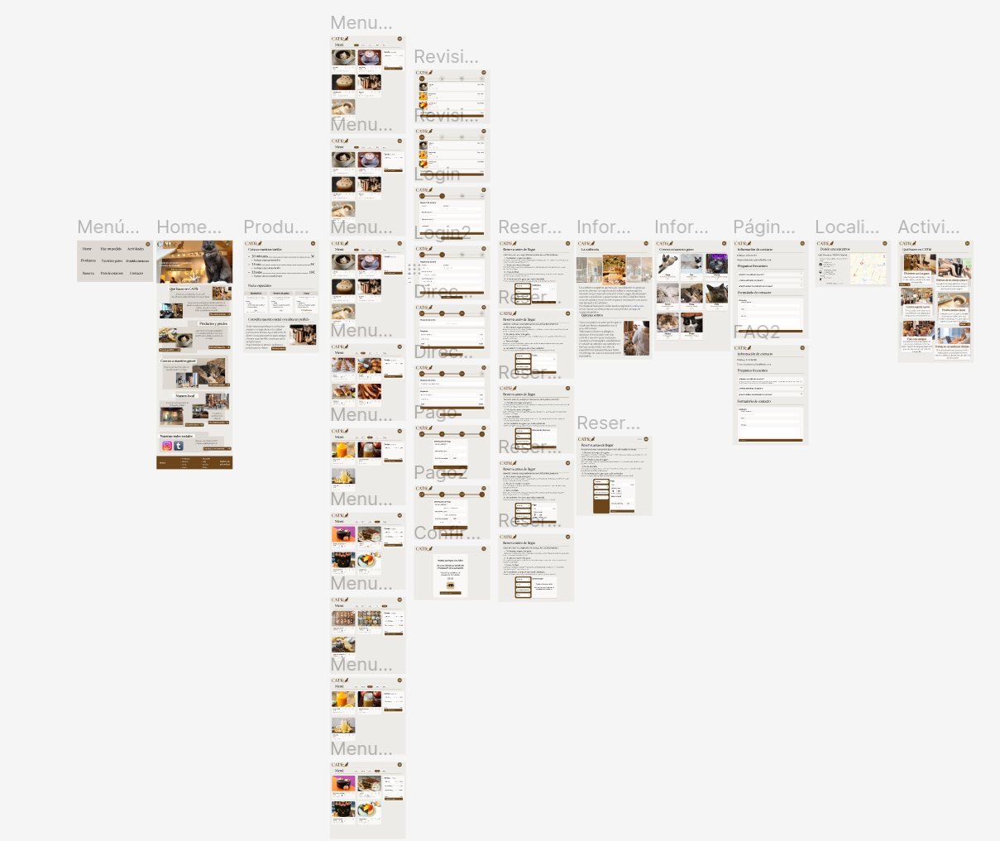

\clearpage

## 1. Introducción {#apartado-1}

En este documento se recoge el desarrollo del caso práctico de la asignatura Interfaces de Usuario. El proyecto consiste en el diseño e implementación de una página web de un restaurante que permita consultar información sobre el establecimiento, reserva de mesa y pedidos a domicilio.

A continuación se expone un conjunto de personas y escenarios de uso de una página web de estas características, el análisis de otras webs similares, la especificación de requisitos funcionales y diseño del prototipo de nuestra web, una comparativa entre el prototipo original y la implementación, un análisis de accesibilidad del sitio web, la evaluación de otro proyecto y las conclusiones del proyecto.

\clearpage

## 2. Personas y escenarios {#apartado-2}

Se han definido tres personas, cada una representante de un tipo de público objetivo de nuestro restaurante, para poder determinar la funcionalidad necesaria en nuestra página web.

Para la especificación de las personas se ha diseñado una plantilla en forma de tabla con el siguiente formado:

\hspace{-\parindent}
\makebox[\textwidth][c]{
    \begin{tabular}{p{3cm}p{12cm}}
        \toprule
        Estereotipo & Tipo de público al que representa \\
        \midrule[0.03em]
        FOTO & Nombre \\
             & Cita \\
        \midrule[0.03em]
        Edad & Número de años \\
        \midrule[0.03em]
        Personalidad & Rasgos definitorios de la persona \\
        \midrule[0.03em]
        Plataforma & Ordenador/móvil/tablet \\
        \midrule[0.03em]
        Experiencia tecnológica & \textbf{Alta}: trata con dispositivos a menudo, se desenvuelve bien y está familiarizado con tramitaciones online \\
         & \textbf{Media}: pese a que está habituado al trato en persona, usa adecuadamente su dispositivo. Aunque necesita que las cosas sean intuitivas y guías para los pasos más complejos \\
         & \textbf{Baja}: poca experiencia con las tramitaciones online, necesita que los pasos sean intuitivos y perfectamente guiados con ayudas visuales \\
        \midrule[0.03em]
        Motivaciones & Qué busca en nuestro local \\
        \bottomrule
    \end{tabular}
}

### 2.1. Jana Pérez {#apartado-21}

\makebox[\textwidth][c]{
    \begin{tabular}{p{3cm}p{12cm}}
        \toprule
        Estereotipo & Joven sociable \\
        \midrule[0.03em]
        \raisebox{-\totalheight+1.5\baselineskip}{\includegraphics{jana.png}} & \shortstack[l]{Jana Pérez\\\textit{``Cada día es una oportunidad para crear algo nuevo y maravilloso''}} \\
        \midrule[0.03em]
        Edad & 21 años \\
        \midrule[0.03em]
        Personalidad & Extrovertida, espontánea, impaciente, social, activa y aventurera \\
        \midrule[0.03em]
        Plataforma & Móvil \\
        \midrule[0.03em]
        Experiencia tecnológica & Media \\
        \midrule[0.03em]
        Motivaciones & Busca quedar con amigos para planes divertidos que poder publicar en sus redes sociales. Quiere poder hacer una reserva de manera fácil en un restaurante interesante, sin tener que rebuscar ni malgastar mucho tiempo \\
        \bottomrule
    \end{tabular}
}

#### Escenario de uso

1. Jana entra en la web
2. Consulta la información acerca del local
3. Reserva desde su *móvil*. Como su grupo de amigos es numeroso, decide pagar en persona en vez de a través de la web.

### 2.2. Emmanuel García-Ruíz {#apartado-22}

\makebox[\textwidth][c]{
    \begin{tabular}{p{3cm}p{12cm}}
        \toprule
        Estereotipo & Persona con alergias  \\
        \midrule[0.03em]
        \raisebox{-\totalheight+1.5\baselineskip}{\includegraphics{enmanuel.png}} & \shortstack[l]{Emmanuel García-Ruíz\\\textit{``Yo soy yo y mi circunstancia. Si no la salvo a ella no me salvo yo''}} \\
        \midrule[0.03em]
        Edad & 50 años \\
        \midrule[0.03em]
        Personalidad & Precavido, relajado, educado, paciente y agradecido \\
        \midrule[0.03em]
        Plataforma & Ordenador y tablet \\
        \midrule[0.03em]
        Experiencia tecnológica & Media \\
        \midrule[0.03em]
        Motivaciones & Busca realizar un pedido a domicilio sin tener que complicarse demasiado. Por tanto, espera que la información sobre alérgenos se exponga de manera clara y sencilla, facilitando el proceso de hacer un pedido \\
        \bottomrule
    \end{tabular}
}

#### Escenario de uso

1. Emmanuel consulta la web desde su ordenador portátil.
2. Consulta la localización del establecimiento, asegurándose de que está cerca de su casa.
3. Usa el menú para navegar hasta la pestaña para hacer un pedido a domicilio
4. Para cada alimento, comprueba los alérgenos a través de la leyenda.
5. Realiza el pedido mediante la secuencia de pasos, guiado por el sistema.

### 2.3. José Daniel Expósito {#apartado-23}

\makebox[\textwidth][c]{
    \begin{tabular}{p{3cm}p{12cm}}
        \toprule
        Estereotipo & Persona solitaria  \\
        \midrule[0.03em]
        \raisebox{-\totalheight+1.5\baselineskip}{\includegraphics{jose_daniel}} & \shortstack[l]{José Daniel Expósito\\\textit{``Jamás hallé compañera más sociable que la soledad, o un gato''}}\\
        \midrule[0.03em]
        Edad & 30 años \\
        \midrule[0.03em]
        Personalidad & Tímido, introvertido, inteligente, trabajador y ocupado \\
        \midrule[0.03em]
        Plataforma & Ordenador \\
        \midrule[0.03em]
        Experiencia tecnológica & Alta \\
        \midrule[0.03em]
        Motivaciones &  Busca un sitio donde trabajar donde pueda disfrutar de la compañía de animales cariñosos, sin que esto le impida completar todas sus tareas. Además de disfrutar de algún tentempié mientras realiza su trabajo \\
        \bottomrule
    \end{tabular}
}

#### Escenario de uso

1. José entra a la web y consulta la información sobre los gatos y actividades.
2. Comprueba si en el establecimiento existe un área de trabajo.
3. Reserva una mesa desde la web para una persona.  

\clearpage

## 3. Análisis de otras webs {#apartado-3}

De forma complementaria al diseño de personas, se han analizado tres páginas web de otros restaurantes para lograr una mayor especificación de funcionalidades para nuestra web. Para cada página web, se han analizado la página principal, la funcionalidad más destacada dentro de la web y otros aspectos funcionales notables.

### 3.1. Taikit {#apartado-31}

[Taikit](https://teikit.es/) es una franquicia de restaurantes especializado en sushi con posibilidad de pedir a domicilio.

#### Página principal

De la página principal destaca el diseño, basado en la simplicidad y con un estilo moderno. La letra es fácilmente legible y contenido accesible a través de un scroll vertical. Además, existe una pequeña animación para indicar la posibilidad de desplazar la ventana hacia abajo.
El contenido está dividido por secciones:

- Un vídeo promocional de la franquicia con un botón para acceder a la página para pedidos on-line.
- Información sobre la marca.
- Best sellers, cada uno enlazado a la carta del restaurante, en el menú de pedidos on-line.
- Enlaces de interés (política de privacidad, redes sociales, contacto...)

La página principal cuenta con información relevante par una persona que entra a la página por primera vez, dándole toda la información necesaria para que pueda conocer la marca y pedir a domicilio fácilmente. No obstante, la presencia de botones distintos con el mismo destino puede resultar confusa.

#### Pedido a domicilio

Esta página engloba la funcionalidad principal de la página web.

El menú es *fácilmente navegable*, permitiendo al usuario seleccionar una categoría y navegar por la misma mediante scroll vertical. Cada plato viene acompañado de un título, foto, descripción, precio e información sobre alérgenos.

La información sobre alérgenos viene especificada por una *leyenda sencilla*, de iconos reconocibles. Una persona puede colocar el ratón sobre el icono para que aparezca un texto con el alérgeno que representa ese icono.

Todo producto seleccionado aparece en un contenedor a la derecha de la pantalla, permitiendo consultar tu pedido en *tiempo real*; así como el precio. Además, este menú te permite aumentar o reducir la cantidad de un producto que hayas seleccionado previamente en la carta.

#### Otros aspectos funcionales

Además de lo antes mencionado, otras funcionalidades destacables de taikit son las siguientes:

- Registro de usuario.
- Página "conócenos" con información sobre la franquicia, políticas de empresa y reseñas de otros clientes.
- Página de contacto.
- Localización de locales.

#### Conclusiones

Taikit destaca sobre todo por su menú a domicilio, caracterizado por la simplicidad y la estética común a toda la página. Su funcionalidad intuitiva, la disposición de elementos y la información que se mantiene accesible al usuario en todo momento hacen de la experiencia de pedir a domicilio algo *sencillo* para todo tipo de personas.

Taikit destaca sobre todo por su menú a domicilio, caracterizado por la simplicidad y la estética común a toda la página. Su funcionalidad intuitiva, la disposición de elementos y la información que se mantiene accesible al usuario en todo momento hacen de la experiencia de pedir a domicilio algo sencillo para todo tipo de personas.

### 3.2. CatCafe Mocha {#apartado-32}

[CatCafé](https://catmocha.jp/) mocha es un franquicia de cat-cafés japonesa, caracterizada por su estética minimalista.

#### Página principal

Destaca el diseño *minimalista*, sobrio y elegante; basado en tonos marrones y blancos. De nuevo, aparece un vídeo promocional acompañado de un indicativo para que aquella persona que visite la web entienda que puede hacer scroll. Además, arriba a la izquierda contamos con la posibilidad de *cambiar el idioma* entre inglés, coreano, japonés y chino. También existe un *header* fijo que nos da acceso al menú de navegación (de tipo hamburguesa), la funcionalidad de cambio de idioma y el logo de la marca.

La página principal está dividida en secciones diferenciadas por separadores (cambio de color de fondo o imágenes):

- Información: en esta sección se da información a usuarios sobre qué es un catcafé, qué se puede hacer allí e información para nuevos visitantes. Cada uno de estos textos viene acompañado de un enlace "read more...", que te dirige a otra página donde con la información más detallada.
- Shoplist: se detalla la localización de distintos establecimientos. Cada una de las localizaciones es un enlace a una página donde se habla específicamente de ese local.
- Noticias y redes sociales.
- Enlaces sobre la compañía, empleo y tratamiento de los gatos.
- Contacto.

#### Localizaciones y actividades

En la página "shoplist" se detallan distintos establecimientos con los que cuenta la franquicia. A través de un menú de pestañas podemos seleccionar la ciudad que deseemos para conocer los locales en dicha ciudad, cada uno acompañado de una breve descripción y una leyenda que indica la cercanía a estaciones de transporte público cercanas. Además, cada uno de los establecimientos es clickable, dirigiéndonos a una página dedicada a dicho local.

También existe una página con actividades que desarrollar en la cafetería. Esto sirve de guía informativa tanto para nuevos clientes como para clientes experimentados; ofreciendo distintas fuentes de entretenimiento para cualquier que visite un cat Café de la franquicia. Las actividades se describen de forma breve, siguiendo con el minimalismo que arropa toda la página; y se acompañan de una foto que sirve como ejemplo. Al final de la página podemos encontrar vídeos donde el propio personal del local desarrolla estas actividades para que la persona que visite la página pueda ver el comportamiento de los gatos y la forma de interactuar con ellos.

#### Otros aspectos funcionales

La web cuenta con una página de preguntas frecuentes que actúan en forma de desplegable. Esto sirve para que una persona pueda desplegar sólo aquellas preguntas de las que quiera saber la respuesta, evitando sobrecargarla de información. Además, las preguntas están organizadas por categorías, a las que podemos acceder a través de un menú de pestañas similar al de la página de "shoplist. También existe otra página que actúa a modo de "conócenos", en la que podemos ver diferentes eslóganes que representan a la marca. Esto permite que una persona entienda la idiosincrasia de la empresa de forma fácil, sin necesidad de leer textos muy largos.

Todas las páginas mantienen la cabecera y el pie de página.

#### Conclusiones

El estilo minimalista y elegante se mantiene en toda la web, y los elementos similares en distintas páginas conservan la misma estructura. Esto le da una *coherencia* a la web que facilita su uso, haciéndola más intuitiva y amigable a toda clase de usuarios.

El estilo minimalista y elegante se mantiene en toda la web, y los elementos similares en distintas páginas conservan la misma estructura. Esto le da un **coherencia** a la web que facilita su uso, haciéndola más intuitiva y amigable a toda clase de usuarios.

A lo largo de toda la web destaca el uso de elementos muy visuales (imágenes, vídeos e iconos) que permiten entender la mayoría de la información aún existiendo la barrera del lenguaje. No obstante, esta barrera se reduce gracias a la posibilidad de cambiar el idioma.

### 3.3. CatFé Santander {#apartado-33}

[CatFé Santander](https://catfe.es/) es una cafetería española que actúa además como refugio de animales, especializado en gatos.

#### Página principal

De forma similar a Catfe Mocha, encontramos un gif con un enlace directo a la reserva de una mesa. Si hacemos scroll vemos secciones diferenciadas en las que encontramos una breve explicación, una galería de imágenes que desliza la imagen cada pocos segundos y un enlace a su página dedicada. Destaca la existencia de una tienda de *merchandising*, complementaria a los servicios de hostelería. Se puede navegar entre páginas a través de los enlaces en las secciones o un menú hamburguesa de despliegue vertical. En el pie de página encontramos enlaces de interés para una persona que visite la página (contacto, política de privacidad y política de cookies) y una flecha que te permite volver al inicio de la página.

En cuanto a la estética, destaca un diseño sobrio basado en tonos marrones.

#### Página de reserva

El proceso de reserva tiene su propia página dedicada. Esta se hace mediante un menú que, con una barra de progreso, guía a la persona durante el proceso de reserva. Además, mediante flechas podremos navegar hacia alante y atrás entre pasos que hayamos completado para modificar los campos. Si deseamos ampliar los campos a rellenar podremos colapsar la barra de progreso para dejar más espacio a lo demás. El paso en el que se encuentra el usuario se muestra mediante un círculo azul, mientras que los pasos completados cuentan con un tick verde.

Destaca el uso de un calendario para poder seleccionar la fecha de reserva. Lo que permite al usuario seleccionar la fecha sin confusiones y evitar errores en el campo de entrada.

#### Otros aspectos funcionales

Aunque no tenga que ver directamente con la hostelería, destaca la tienda on-line de la web. Los productos se muestran en forma de matriz, con una foto y un título, además de un botón que permite añadirlo al carrito. También, cada una de las fotos es clickable, llevándote a una página dedicada al producto. También destaca el blog del local, donde podemos ver distintos consejos sobre el cuidado de gatos.

Existe además un contador en la página de "Conócenos", donde se detalla el número de gatos rescatados gracias a CatFé Santander.

#### Conclusiones

La estética hogareña y el tono de la página, además del énfasis en el rescate de gatos y el cuidado de los mismos permiten transmitir una *imagen de cercanía y confianza* hacia la marca.

El proceso de reserva es muy cómodo gracias a la *barra de proceso y la guía se da durante el proceso*.

## 4. Diseño del prototipo {#apartado-4}

### 4.1. Requisitos funcionales {#apartado-41}

Teniendo en cuenta tanto los escenarios del [apartado 2](#apartado-2) y el análisis del [apartado 3](#apartado-3), se han determinado 11 funcionalidades que deben estar implementadas en nuestra web. Estas se recogen a continuación en la siguiente tabla:

\hspace{-\parindent}
\makebox[\textwidth][c]{
    \begin{tabular}{p{0.75cm}p{5.25cm}p{9cm}}
        \toprule
        ID & Funcionalidad & Descripción \\
        \midrule[0.03em]
        Fun1 & Reserva de mesa & Permitirá seleccionar el número de comensales, fecha, hora y pagar on-line o en el establecimiento \\
        \midrule[0.03em]
        Fun2 & Menú de productos & Contendrá la descripción, información sobre alérgenos y precio para cada producto \\
        \midrule[0.03em]
        Fun3 & Pedido a domicilio & se podrá realizar un pedido de uno o varios elementos del menú \\
        \midrule[0.03em]
        Fun4 & información del establecimiento & Existirá una página o sección con la historia del local, destino de la facturación e imágenes del establecimiento \\
        \midrule[0.03em]
        Fun5 & Información de los gatos & se incluirá un página o sección donde, para cada gato, se incluya una foto, nombre, género, edad y personalidad \\
        \midrule[0.03em]
        Fun6 & Registro de usuario & para los pedidos a domicilio, debe existir un registro de usuario \\
        \midrule[0.03em]
        Fun7 & Menú de navegación hamburguesa & Abrirá una ventana con enlaces a las demás páginas \\
        \midrule[0.03em]
        Fun8 & Página de contacto & Debe existir una página con información de contacto, preguntas frecuentes y un formulario de contacto \\
        \midrule[0.03em]
        Fun9 & Página con actividades & Debe existir una página que describa qué tipo de actividades se pueden llevar a cabo en el establecimiento \\
        \midrule[0.03em]
        Fun10 & Localización del local & Debe existir una página o sección que incluya un mapa con la ubicación del local, así como información relativa a paradas cercanas de transporte público o similares \\
        \bottomrule
    \end{tabular}
}

### 4.2. Prototipo {#apartado-42}

Hemos desarrollado un prototipo mediante la herramienta Figma que pretende representar con una alta fidelidad visual y funcional nuestra web. En él se puede experimentar cómo un usuario ejecutaría las acciones descritas en el escenario de la [sección 2.3](#apartado-23).

Puede consultar el prototipo en el siguiente [enlace](https://www.figma.com/proto/oiuQy7r7wn6Hb3JY99RUGq/Prototipo?node-id=1-2&starting-point-node-id=1%3A2&scaling=scale-down-width&mode=design&t=CFaFBGQ1qCeq90HY-1)

El prototipo incluye todas las páginas de la web, permitiéndote navegar entre ellas a través de distintos botones tal y cómo se hará en el diseño final.

{width=\textwidth}

#### Página Home

Esta página cuenta con distintas secciones donde se puede consultar un poco de información sobre el establecimiento. En cada sección existe un botón que llevará a la persona a la página en específico donde pueda consultar de forma más detallada aquel aspecto que le interese. Además, al igual que en el resto de páginas, tendremos una cabecera común con el nombre y logo del restaurante, así cómo el acceso al menú hamburguesa. A las secciones se accede mediante scroll vertical.

#### Página de actividades

Esta página está destinada a la gente que no conozca qué es un cat café. Contiene una serie de sugerencias sobre actividades que se pueden llevar acabo en este tipo de locales. Además, aquellas actividades relacionadas con los gatos o la comida cuentan con un enlace a la página sobre los gatos y el menú respectivamente. Cada una de las actividades se describe a través de una foto y un breve texto.

#### Página de contacto

En esta página existen 3 secciones, separadas por un título y una línea horizontal.

La primera sección cuenta con el número de teléfono y el correo electrónico del restaurante. De esta forma, cualquier cliente puede acceder rápidamente a una forma de comunicación directa con el establecimiento.

La segunda sección cuenta con varios desplegables, cada uno con una pregunta general sobre el establecimiento. Estas son dudas comunes que suelen tener clientes de esta clase de establecimientos.

La tercera es un formulario de contacto a través del cual, una persona puede mandar su duda o inquietud al restaurante.

#### Página establecimiento

En esta sección funciona como un "quiénes somos". En ella se describe el tipo de local y servicio que se ofrece, así cómo los objetivos e ideales de la marca. Esto se hace en dos secciones diferenciadas, de nuevo, por un título y una línea horizontal.

#### Página gatos

En esta página podemos consultar información acerca de los gatos. Esto es información de interés para aquellas personas amantes de esta clase de animales.

Cada gato tiene su propio cuadro donde podemos consultar nombre, actitud, edad y sexo.

#### Página localización

En esta página podemos consultar dónde se encuentra el establecimiento, así cómo su cercanía a distintas estaciones de transporte público. También existe un enlace a la página de contacto.

#### Página menú

En esta página se puede consultar la carta, donde los productos están separados por categorías. Por defecto se mostrará la categoría de cafés, aunque se puede acceder a cualquier otra clickando en algunos de los botones de la parte superior. La categoría seleccionada tendrá un color marrón, mientras que el resto de categorías aparecerán en blanco.

También, se pueden seleccionar productos para hacer un pedido. Los productos seleccionados (a través del botón '+') aparecerán instantáneamente en el carrito, desde donde los podremos eliminar o añadir unidades; esta funcionalidad también se puede hacer desde cada producto. Una vez terminado el pedido podremos revisar y efectuar el pedido a través de botón "Revisar y pagar".

Para revisar y pagar el pedido se nos llevará a una página con una barra de progreso. Siguiendo los cuatro pasos podremos efectuar el pedido y aparecerá una pequeña animación indicando al cliente que su pedido se ha llevado a cabo.

#### Página reserva

En esta página podremos efectuar una reserva de una mesa en el local. Primero, se especifican las normas del establecimiento; a continuación, existe un contenedor con 4 pasos para poder hacer la reserva. El proceso se guía a través de una pequeña caja redonda junto a cada paso que, una vez completado, se rellena con un tick verde.

#### Página tarifas

Las cafeterías de este estilo suelen ofrecer planes por tiempo en el local. En esta página se pueden consultar los precios y contenidos de estos planes, así como un pequeño resumen del tipo de productos que se ofrecen.

\clearpage

### Patrones y heurísticas

A la hora de hacer el diseño y prototipado se han aplicado las siguientes heurísticas:

- Consistencia y estandarización: se aplica el mismo patrón de diseño para los bloques de contenido con botones.
- Minimalismo: el diseño está adaptado para no sobrecargar a la persona de información. Se aprecia fácilmente en los formularios de registro de usuario.
- Visibilidad del estado del sistema: se da retro-alimentación al usuario a través de mensajes de confirmación para los pedidos a domicilio y reserva de mesas.
- Control de usuario y libertad: en el pedido a domicilio y la reserva de mesa existen botones para avanzar y retroceder.

Además aplicamos los siguientes patrones:

- Site Branding (E1): todas las páginas contienen el logo en la esquina superior derecha.
- Botón de acción (K4): Se usan botones para activar acciones.
- Barra de progreso (H13): el proceso de realizar un pedido se acompaña de una barra de progreso que indica los pasos anteriores, el paso actual y los pasos siguientes.
- Prevención de errores (K12): los formularios aportan pistas sobre cómo se deben rellenar para evitar errores por el formato de entrada.
- Plantillas de páginas (D1): todas las páginas usan una plantilla global con cabecera (que incluye el botón para acceder al menú de hamburguesa) y plantillas individuales para cada tipo de página.
- Carrito de compra (F3): en el proceso de hacer un pedido, existe un carrito de compra donde se pueden consultar en tiempo real los productos seleccionados hasta el momento.

## 5. Diseño final {#apartado-5}

El diseño final cuenta con 8 páginas, 9 hojas de estilo y 13 scripts de `javaScript`. Para los elementos compartidos como la cabecera se ha empleado un script de `javaScript` para incluirlo en cada página con el mismo formato, permitiéndonos modificar la cabecera en un único sitio. Además, existe una hoja de estilos `shared.css` que contiene los estilos compartidos para todas las páginas como los encabezados, el texto o la distribución de columnas.

En cuanto al comportamiento *responsive*, se ha decidido usar una aproximación de diseño por columnas. Se ha dividido el espacio de la página horizontalmente en 12 columnas y a cada elemento se le asigna un tamaño en número de columnas. De esta forma, se facilita la distribución de elementos por la página. Además, para dispositivos de distinto tamaño se varía el tamaño de las columnas o, en su defecto, de los objetos de forma que permite un código más limpio con un buen resultado.

Comparando el prototipo con el diseño final, destacamos 3 errores que recibimos durante la defensa:

- El menú de navegación contaba con demasiadas páginas y su uso en pantalla completa podría llegar a desorientar, perdiendo la referencia sobre en qué página se encuentra uno actualmente.
- Existen demasiadas páginas, algunas de ellas con información redundante.
- El indicativo para hacer scroll era un elemento innecesario y que rompía la estética de la página.

Cada uno de estos errores ha sido corregido. El menú de navegación se ha sustituído por un menú lateral que ocupa aproximadamente un cuarto del ancho de la pantalla. Las páginas de localización y establecimiento se han combinado ya que contenían información fácilmente acoplable, reduciendo el número de páginas.

También se han hecho algunas modificaciones por necesidades de implementación: 
- Se han eliminado los puntos que enlazaban precio con productos en la página de tarifas.
- Se han recolocado algunos botones en las páginas Home y activiades para su comportamiento responsive. 

Teniendo todo lo anterior en cuenta, el diseño final se mantiene fiel al prototipo, aunque con leves variaciones que mejoran el producto final. 

\clearpage

## 6. Informe de accesibilidad {#apartado-6}

Para realizar el análisis de accesibilidad, en este caso se ha optado por comprobar el aspecto de las páginascon una herramienta llamada _"WAVE"_. Esta utilidad nos permite analizar el prototipo en busca de consejos o errores para mejorar en este aspecto.

En el análisis, se encuentran los siguientes errores:

- Errores de contraste: Adventencias debido a que el contraste entre el color del texto para algunos párrafos (Ej. descripciones de productos) y el fondo de la página web es demasiado bajo.

- Falta de inclusión de etiquetas de título en algunas secciones ( Ej. h1,h2,h3,...): Hay párafos con estilo de títulos que no lo son.

- Largos bloques de información justificados plenamente puede perjudicar la lectura de las páginas.

- Algúnas etiquetas no estaban asociadas a ningún elemento en los formularios

### Errores de Contraste
En nuestro deseño del prototipo, se ha acordado utilizar colores claros de fondo y texto oscuro. Comprobamos que esa configuración de colores era la que mejor combinaba a la hora de crear el estilo de un Catcafé.

La combinación de colores incluye: 

- Color marrón para títulos y fondos de botones de navegación
- Blanco con tonalidad gris para el fondo de las páginas web
- Color negro para textos generales
- Color gris claro para la descripción de los productos y el fondo de botones de operaciones con los pedidos
- Fondo blanco para los productos.

Al validar la accesibilidad analizando las páginas con el plugin de _"WAVE"_, se mostraron bastantes errores mencionando que el contraste los colores del fondo del producto y el de las descripciones de los productos era bastante bajo. Esto impide la legibilidad a los productos en cuestión. 

### Falta de inclusión de etiquetas de título

Siguiendo el diseño compartido del prototipo, a la hora de implementación algunos headers o Títulos primarios carecían de elementos H1, H3 o similares.
Como consecuencia de esto, revisando la página con _"WAVE"_, se ha detectado esa carencia como advertencias de accesibilidad.

Dichas advertencias se han localizado en algúnos encabezados de secciones como las de la página web de _"Tarifas"_.

### Párrafos con apariencias H1 o H3 que no lo son

En la implementación de algunos bloques de textos en las páginas web, se ha optado por adoptar un tamaño de fuente más grande para mejorar la accesibilidad. Debido al grande tamaño del texto, el plugin de _"WAVE"_ detecta que tiene estilo de un título de alguna sección cuando en realidad no lo és.
Dicho texto se puede encontrar en la cantidad de artículos, el nombre de los artículos, en los títulos del carrito y los formularios (los cuales se han implementado como headers sin título).

### Justificación repetitiva de grandes bloques de texto

Utilizar la justificación de textos de manera repetitiva en las páginas es considerado como un contra o defecto que afecta a la legibilidad de las páginas por el plugin de _"WAVE"_.

Dicho defecto se ha encontrado por ejemplo en la página de menú de productos para todo el texto en ella.

### Etiquetas no asociadas a un campo

En la implementación del proceso de reserva había algunas etiquetas o labels que no estaban asociadas a nada o marginadas. A la hora de la revisión, el plugin de accesibilidad _"WAVE"_ nos lo detectó como advertencias a la hora de reservar en nuestro Catcafé. 

### Correcciones de los Errores y advertencias

Para corregir los errores y advertencias mencionadas, se han aplicado las siguentes soluciones:

- Etiquetas no asociadas a un campo: Solucionamos estas advertencias modificando simplemente la propiedad _"for"_ de los objetos _"label"_ para que todas se refirieran a algo en la implementación del HTML de las páginas.

- Justificación repetitiva de texto: Este tipo de advertencias se solventaron modificando el CSS o las clases de estilo de los textos para intercalar la propiedad de _"text-justify"_ y la de _"justify-content"_ en las páginas.

- Apariencias en estilo de H1 o H3 en textos que no lo son: Este tipo de advertencias se ha dedicido ignorarla, ya que reducir el tamaño de la fuente en esos casos sería un problema aún mayor de visibilidad.

- Falta de inclusión de etiquetas de título: Se solucionaron añadiendo etiquetas h1 y h2 con el estilo estandard definido por la página como elementos.

- Errores de contraste: Se ha modificado la paleta de colores estandard de la página para incluir texto de color negro en vez de gris claro en las descripciones de los productos.

\clearpage

## 7. Descripción de tecnologías utilizadas {#apartado-7}

Durante el desarrollo de esta práctica hemos empleado distintas tecnologías con diversos fines.

Durante la fase de documentación hemos hecho uso de la herramienta **inspeccionar**. Esta herramienta nos ha permitido analizar en profundidad la organización de contenido y los estilos de las páginas web analizadas en el [apartado 3](#apartado-3). Además, esta herramienta ha sido verdaderamente últil para el testeo del producto final y su comportamiento responsive. 

Para el prototipado hemos empleado **Figma**. Figma es una herramienta de diseño colaborativo que nos ha permitido trabajar en paralelo sobre un diseño común. Ademaś, una vez finalizado el prototipo, Figma nos ha permitido representar fielmente el comportamiento que esperábamos de nuestra web; lo que ha servido de punto de referencia durante todo el desarrollo. Esto ha permitido un flujo de trabajo cómodo en el que todos los integrantes del grupo han estado plenamente coordinados. 

\clearpage

## 8. Evaluación SUS {#apartado-8}

Para la evaluación SUS se han facilitado 3 cuestionarios a un grupo de 3 evaluadores. El primero se trata de un cuestionario de consentimiento, el segundo para optener datos de la población de evaluadores y el tercero con las 10 preguntas propias del cuestionario SUS. 

En cuanto al primer y segundo cuestionario, contamos con el consentimiento de los 3 evaluadores para realizar el estudio. Además, sabemos que se trata de una población masculina, de entre 22 y 27 años y con grandes conocimientos en el ámbito de la tecnología. Estos datos son esperables puesto que se nos hallamos en el contexto de una clase de alumnos de informática. Es por esto que concluímos que para hacer una correcta evaluación SUS deberíamos ampliar el espectro de evaluadores para obtener datos de otra clase de poblaciones.

El tercer cuestionario se rellenará con el fin de evaluar la tarea: "Haz un pedido y luego haz una reserva". Los resultados quedan recogidos en la siguiente tabla: 

|   Pregunta  | Evaluador 1 | Evaluador 2 | Evaluador 3 | 
| :---------: | :---------: | :---------: | :---------: |
|      1      |      4      |      4      |      5      |
|      2      |      2      |      1      |      2      |
|      3      |      5      |      5      |      4      |
|      4      |      1      |      1      |      1      |
|      5      |      4      |      4      |      4      |
|      6      |      1      |      1      |      1      |
|      7      |      5      |      4      |      4      |
|      8      |      2      |      1      |      1      |
|      9      |      4      |      4      |      4      |
|     10      |      3      |      1      |      2      |
| comentarios positivos | La interfaz gráfica es muy agradable a la vista, además está muy bien organizada, de manera que no satura al usuario. | La estética es limpia, el proceso de realizar un pedido es intuitivo y cómodo. Aunque mi favorito es la reserva de mesa, las animaciones y popups hacen que casi sin darte cuenta ya tengas una mesa en CatFé a tu nombre | Estética sobria y elegante |
| comentarios negativos |  Demasiadas fotos.           |      Nada      |    se podría mejorar el feedback de algunos elementos clickables      |

Con estos resultados, calculamos la nota media del cuestionario SUS para nuestra web: 

Sea $N_i$ la nota resultante de la evaluación del evaulador $i$: 
$$N_i = 2,5\cdot\sum_{n=1}^{10} v_n, \text{ donde } v_n = 
\left\{\begin{array}{ll}
    \text{valorPregunta}_n - 1 & \text{si n es impar}\\
    \\
    5 - \text{valorPregunta}_n & \text{si n es par}\\

\end{array}\right.$$

$$\overline N = \frac{N_1 + N_2 + N_3}{3} = \frac{82,5 + 90 + 85}{3} = 85,83$$

Obtenemos un resultado de $85.83$ en la evaluación SUS, lo que se corresponde con una calificación A. Esto nos lleva a concluir que la usabilidad de nuestra web es alta y que las personas con perfiles similares al de los evaluadores encuentran la web agradable y la recomendarían a sus allegados.

\clearpage

## 9. Conclusiones {#apartado-9}
